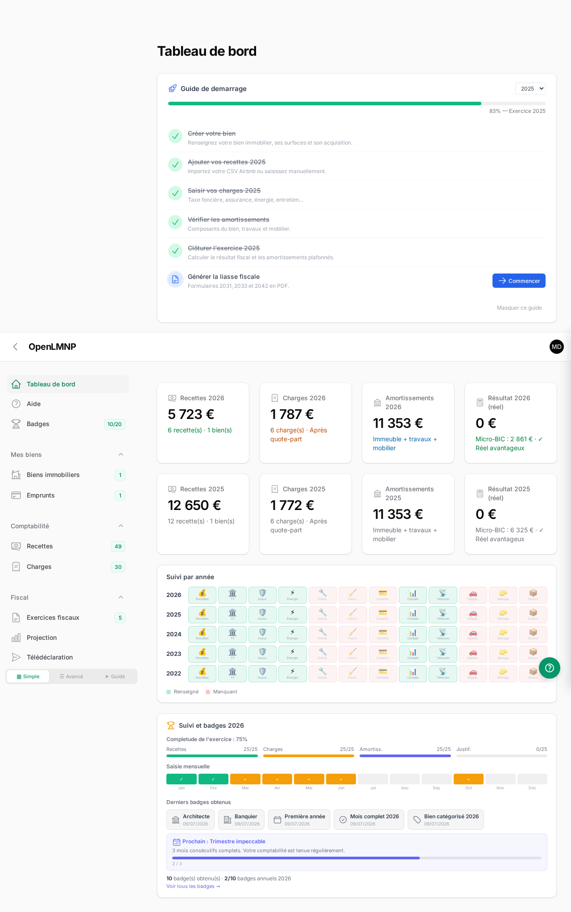

<!--
N.B.: This README was automatically generated by <https://github.com/YunoHost/apps_tools/blob/main/readme_generator>
It shall NOT be edited by hand.
-->

<h1>
  
  OpenLMNP, packaged for YunoHost
</h1>

Accounting and tax filing for French furnished rentals (LMNP)

[](https://openlmnp.fr)
[](https://app.openlmnp.fr)
[?style=for-the-badge)](https://ci-apps.yunohost.org/ci/apps/openlmnp/)

<div align="center">
<a href="https://apps.yunohost.org/app/openlmnp"></a>
<a href="https://github.com/YunoHost-Apps/openlmnp_ynh/issues"></a>
</div>


## Screenshots


## 📦 Developer info

[](https://ci-apps.yunohost.org/ci/apps/openlmnp/)

🛠️ Upstream OpenLMNP repository: <https://github.com/manganate006/openlmnp>

Pull request are welcome and should target the [`testing` branch](https://github.com/YunoHost-Apps/openlmnp_ynh/tree/testing).

The `testing` branch can be tested using:
```
# fresh install:
sudo yunohost app install https://github.com/YunoHost-Apps/openlmnp_ynh/tree/testing

# upgrade an existing install:
sudo yunohost app upgrade openlmnp -u https://github.com/YunoHost-Apps/openlmnp_ynh/tree/testing
```

You can also switch to the testing branch to update from testing by default (as same as for APT when you chose to use a testing repos) with this command:
```bash
sudo yunohost app setting openlmnp upgrade_channel -v testing
```

### 📚 App packaging documentation

Please see <https://doc.yunohost.org/dev/packaging/> for more information.
